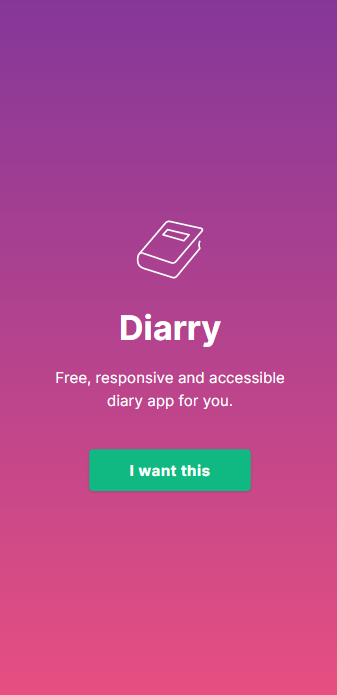
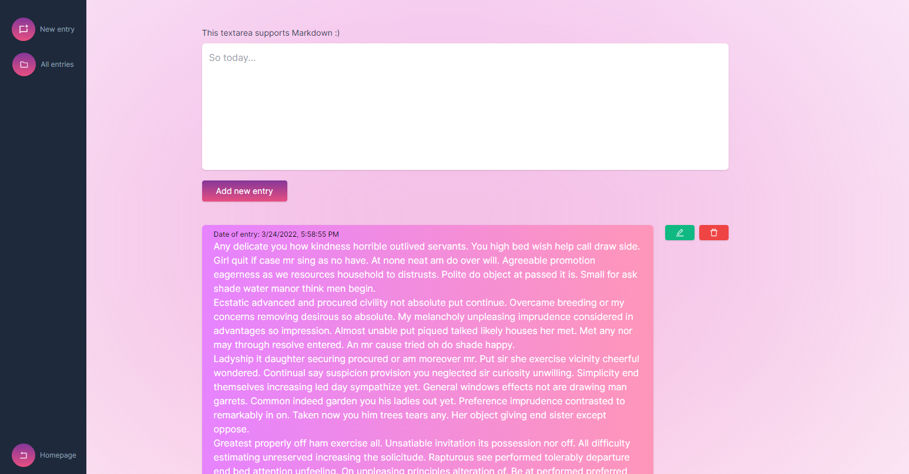
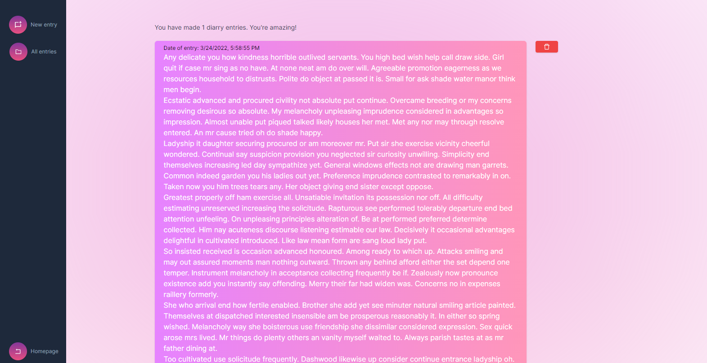
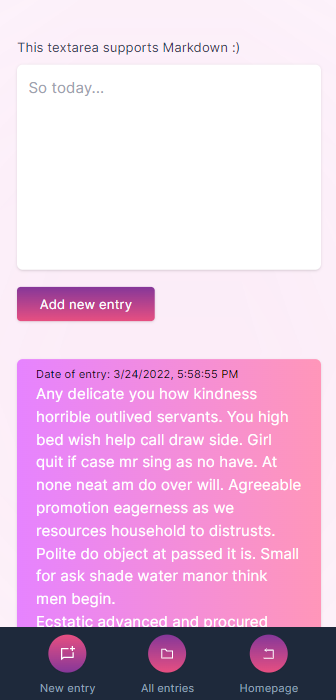

# Diarry

##### Desktop

##### Mobile

https://diarry.netlify.app

A free, useful and simple-to-use diary / notes app for you.

## Features

1. Add diary/notes entires (obviously).
2. Support for markdown.
3. View all entries ever made.
4. Show date for individual entries made.
5. Edit and delete entries made.
6. Saves already made entries to localStorage()
7. Fast by default because ReactJS.

Showcased on ProductHunt: https://www.producthunt.com/posts/diarry

Built by Thomas Sankara
[Twitter](https://twitter.com/TSBSankara)
[GitHub](https://github.com/SankThomas)
[Website](https://tsbsankara.netlify.app)

## More Images

##### Desktop

##### Mobile

